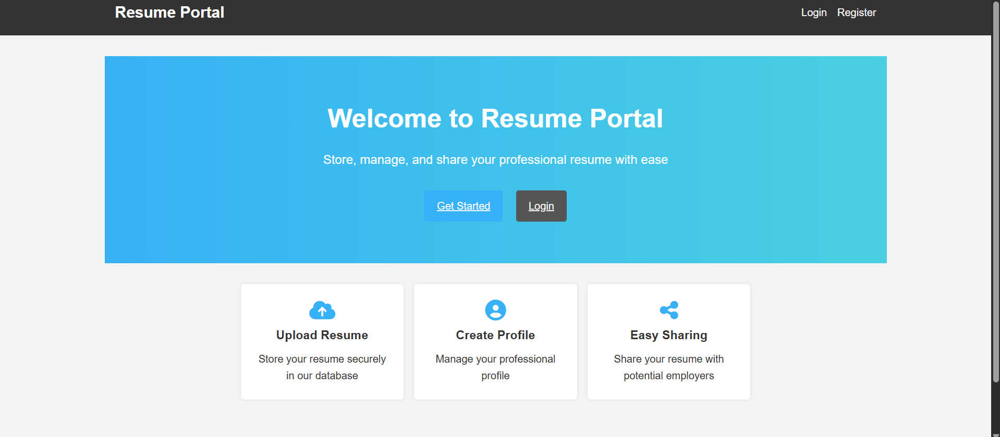
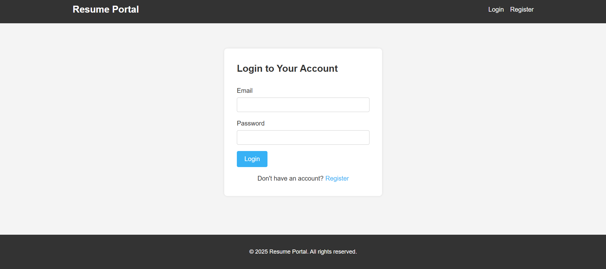
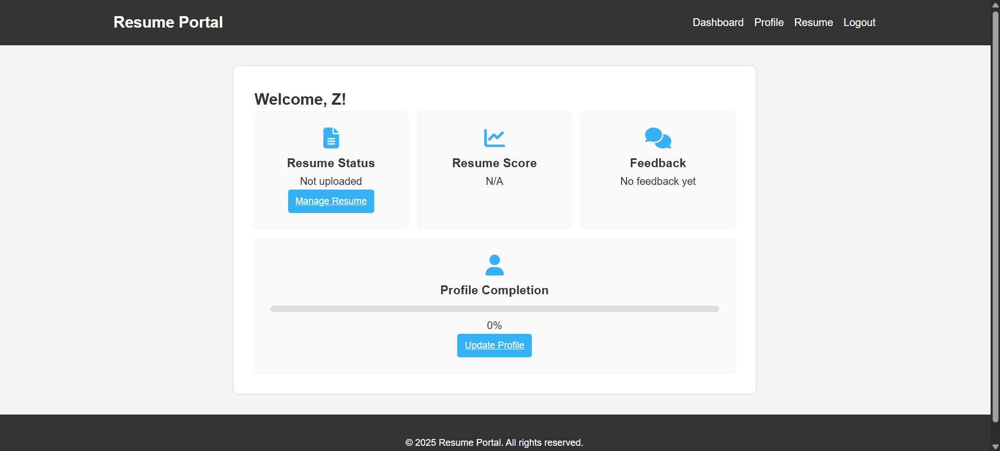
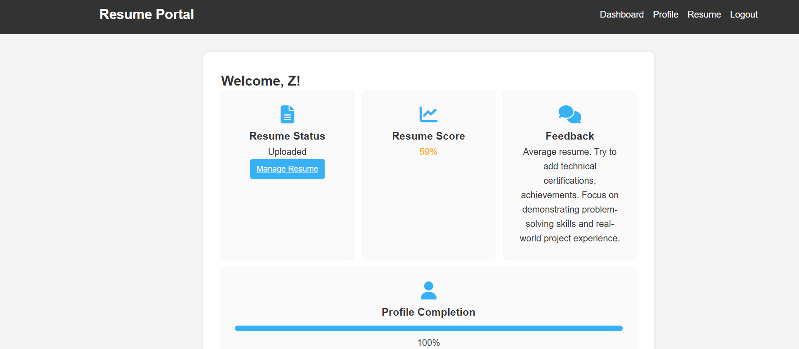

# 🤖 AI-Powered Resume Scoring & Feedback

> An intelligent web application that scores resumes using a Machine Learning model and delivers personalized AI-generated feedback — all through a clean, easy-to-use web interface.

---

## ✨ Features

| Feature | Description |
|--------|-------------|
| 📄 Resume Upload | Upload PDF or Word (.docx) resumes through the browser |
| 🧠 AI Scoring | ML model (Random Forest) scores resumes out of 100 |
| 💬 Personalized Feedback | AI-generated feedback based on skills, experience & projects |
| 🔐 User Authentication | Secure login/register with bcrypt password hashing |
| 📊 Dashboard | View score, feedback, and profile completion status |
| 🗄️ Database Storage | Resumes and user data stored securely in MySQL |

---

## 🖼️ Screenshots

<details>
<summary>Click to expand screenshots</summary>

#### 🏠 Home Page


#### 🔑 Login Page


#### 📋 Dashboard (Before Upload)


#### ✅ Dashboard (After Upload)


#### 📤 Resume Upload Section


#### 📈 Model Evaluation Results


</details>

---

## 📊 Model Performance

The ML model (scikit-learn `RandomForestRegressor`) achieves excellent results:

| Metric | Value |
|--------|-------|
| **R² Score** | 0.971 (97.1%) |
| **Train R²** | 0.995 (99.5%) |
| **MAE** | 2.44 |
| **RMSE** | 3.83 |
| **CV RMSE** | 3.66 ± 0.39 |

**Top Predictive Features:**
- 🏆 Experience (Years) → 0.720
- 🚀 Projects Count → 0.237
- 📜 Certifications → 0.010

---

## 🗂️ Project Structure

```
AI-Powered-Resume-Scoring-and-Feedback/
├── server.js               # Node.js Express backend (port 3000)
├── package.json            # Node.js dependencies & scripts
├── .env.example            # Environment variable template
├── .gitignore
├── public/                 # Frontend static files
│   ├── index.html
│   ├── app.js
│   └── style.css
├── ml_model/               # Python ML module
│   ├── train_model.py      # Train the Random Forest model
│   ├── resume_api.py       # FastAPI server for predictions (port 8000)
│   ├── test.py             # Model evaluation & testing
│   ├── requirements.txt    # Python dependencies
│   ├── AI_Resume_Screening.csv  # Training dataset
│   └── model/             # Saved model artifacts (generated)
└── docs/                   # Screenshots & documentation images
```

---

## 🛠️ Tech Stack

**Frontend / Backend**
- Node.js + Express
- HTML / CSS / JavaScript
- MySQL (via `mysql2`)
- Session auth with `bcrypt`

**Machine Learning**
- Python 3.8+
- scikit-learn (RandomForestRegressor)
- FastAPI + Uvicorn
- pandas, numpy, joblib, matplotlib

---

## 🚀 Getting Started

### Prerequisites
- [Node.js](https://nodejs.org/) v14+
- [Python](https://www.python.org/) 3.8+
- [MySQL](https://www.mysql.com/) Server

---

### 1️⃣ Clone the repository

```bash
git clone https://github.com/YOUR_USERNAME/AI-Powered-Resume-Scoring-and-Feedback.git
cd AI-Powered-Resume-Scoring-and-Feedback
```

---

### 2️⃣ Set up environment variables

Copy the example file and fill in your credentials:

```bash
cp .env.example .env
```

Edit `.env`:
```env
DB_HOST=localhost
DB_USER=root
DB_PASSWORD=your_password_here
DB_NAME=resume_portal
PORT=3000
ML_API_URL=http://localhost:8000/predict
```

---

### 3️⃣ Install Node.js dependencies

```bash
npm install
```

---

### 4️⃣ Set up the Python ML environment

```bash
cd ml_model
python -m venv .venv

# On macOS/Linux:
source .venv/bin/activate

# On Windows:
.venv\Scripts\activate

pip install -r requirements.txt
```

---

### 5️⃣ Train the ML model

```bash
python train_model.py
```

This reads `AI_Resume_Screening.csv` and saves trained model artifacts into `model/`.

---

### 6️⃣ Start the Python FastAPI server

```bash
uvicorn resume_api:app --reload
```

The ML API will be live at `http://localhost:8000`.
Visit `http://localhost:8000/docs` for interactive Swagger UI.

---

### 7️⃣ Start the Node.js server

```bash
# From the project root
node server.js
```

Open your browser at **`http://localhost:3000`** 🎉

---

## 🔌 API Reference

### Python FastAPI (`localhost:8000`)

| Method | Endpoint | Description |
|--------|----------|-------------|
| `GET` | `/` | Health check |
| `POST` | `/predict` | Score a resume |

**Example request:**
```json
POST http://localhost:8000/predict
{
  "skills": "Python, React, AWS",
  "experience": 5,
  "education": "B.Tech",
  "certifications": "AWS Certified",
  "projects": 8,
  "salary": 80000
}
```

---

## ⚙️ Optional: Run Model Evaluation

```bash
cd ml_model
python test.py
```

Generates:
- `model_metrics.json` — full evaluation metrics
- `top_feature_importances.csv` — feature importance rankings
- `model_residuals.png` — residual distribution plot

---

## 🐍 Python Dependencies

| Package | Version | Purpose |
|---------|---------|---------|
| `numpy` | 1.26.4 | Numerical computing |
| `pandas` | 2.0.3 | Data manipulation |
| `scikit-learn` | 1.2.2 | ML algorithms |
| `joblib` | 1.3.2 | Model serialization |
| `matplotlib` | 3.8.0 | Visualization |
| `fastapi` | 0.110.0 | API framework |
| `uvicorn` | 0.29.0 | ASGI server |

---

## 🤝 Contributing

1. Fork the repository
2. Create your feature branch: `git checkout -b feature/amazing-feature`
3. Commit your changes: `git commit -m 'Add amazing feature'`
4. Push to the branch: `git push origin feature/amazing-feature`
5. Open a Pull Request

---

## 📄 License

This project is open-source. Consider adding an [MIT License](https://choosealicense.com/licenses/mit/) to make it official.

---

## 👤 Author

Made with ❤️ — feel free to ⭐ the repo if you find it useful!
